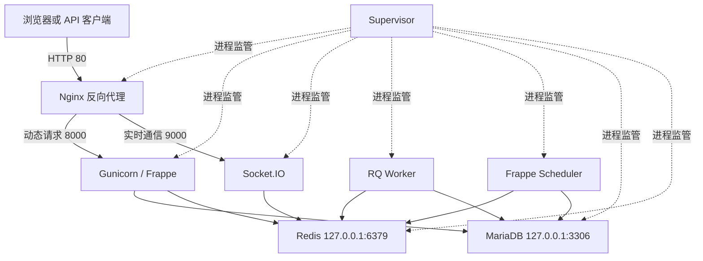
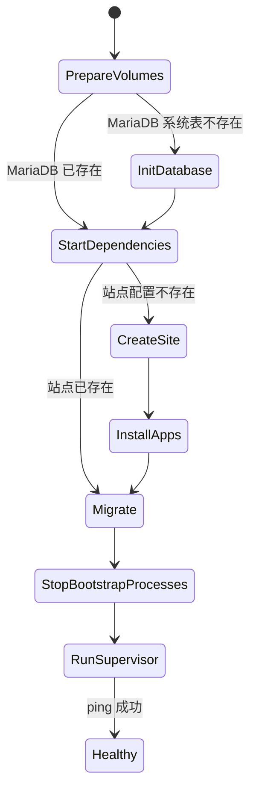

# Docker 基础架构设计

状态：已采纳  
范围：ERPNext V16 中文单容器发行版基础设施  
不包含：企业主数据、业务单据、科目初始化及客户定制

## 1. 设计决策

本发行版采用“一个业务容器、多个持久化卷”的 all-in-one 模型。容器内由 Supervisor 管理 MariaDB、Redis、Frappe Web、WebSocket、队列、调度器和 Nginx；Docker 只发布 Nginx 的 HTTP 端口。

选择该模型是为了满足单容器交付、离线搬运和低门槛单机部署。代价是数据库、缓存与应用不能独立扩缩容，任何一个容器故障都会影响全部服务。因此本设计面向单机、PoC、中小规模内部部署，不声明具有多节点高可用能力。

## 2. 逻辑拓扑



网络边界：MariaDB、Redis、Gunicorn 和 Socket.IO 只监听容器回环地址，不映射到宿主机。TLS 由宿主机或外部反向代理终止。

## 3. 镜像分层

| 层 | 内容 | 更新触发条件 |
| --- | --- | --- |
| 基础层 | 官方 `frappe/bench` 镜像（固定 digest）与系统运行依赖 | Python、Node、Bench 或安全补丁变化 |
| 框架层 | 官方 Frappe V16 标签源码 | Frappe V16 更新 |
| 应用层 | 官方 ERPNext V16、HRMS、CRM、中国会计 App | App 版本更新 |
| 资源层 | Python/Node 依赖和前端静态资源 | 任一 App 依赖变化 |
| 运行层 | Entrypoint、Supervisor、Nginx、MariaDB、Redis 配置 | 基础设施配置变化 |

镜像不得包含站点数据库、`site_config.json`、附件、备份、真实密码或企业初始化数据。

Yarn、UV 和 Pip 下载缓存使用 BuildKit cache mount，在构建步骤之间复用但不写入成品镜像层。获取 ERPNext、HRMS、CRM 和本地化 App 时跳过逐 App 资源编译，全部 App 就位后仅执行一次 `bench build --production`；Frappe WebSocket 运行所需的 `frappe/node_modules` 必须保留。

## 4. 版本通道

开发集成通道允许跟踪 `version-16` 分支，以便持续发现上游兼容性变化。正式发行通道必须把基础镜像固定到 digest，并把 Frappe、ERPNext、HRMS、CRM 及可选 App 固定到已验证标签或完整提交 SHA。

```text
开发通道：version-16/main -> 每日或每周兼容性构建
候选通道：不可变 ref -> 空站点 + 备份恢复测试
正式通道：镜像 digest -> 发布与回滚依据
```

容器运行后禁止 `bench update`，否则会产生无法由 Dockerfile 重建的漂移状态。

## 5. 持久化设计

| Docker volume | 容器路径 | 数据性质 | 备份等级 |
| --- | --- | --- | --- |
| `database` | `/var/lib/mysql` | 业务数据库 | 必须，事务一致性 |
| `redis` | `/var/lib/redis` | 队列与缓存持久化 | 建议，降低未完成任务丢失 |
| `sites` | `/home/frappe/frappe-bench/sites` | 站点配置和附件 | 必须，与数据库同一恢复点 |
| `logs` | `/home/frappe/frappe-bench/logs` | Bench 诊断日志 | 按保留策略 |

数据库和 `sites` 必须作为一个恢复集合管理。仅恢复其中一个可能造成附件、加密密钥或数据库记录不一致。Redis 不作为业务事实来源，但启用 AOF 以降低容器重启时队列任务丢失概率。

## 6. 初始化状态机



首次启动只创建空站点并安装镜像内 App。后续启动只执行幂等配置和 `bench migrate`。任何初始化步骤失败时容器应退出，由 Docker 的重启策略重试；不得跳过失败迁移后继续提供流量。

## 7. 进程与停机

- Compose 使用 `init: true` 处理孤儿进程和信号转发。
- Supervisor 负责所有长期进程，配置进程组停止，避免 Worker 或 Node 子进程遗留。
- `stop_grace_period` 为两分钟，给请求、Worker 和 MariaDB 留出退出时间。
- 应用日志输出到 stdout/stderr；Bench 文件日志单独挂卷，避免镜像层持续增长。

## 8. 健康检查

容器健康检查先确认 MariaDB、Redis、Gunicorn、WebSocket、Worker、Scheduler 和 Nginx 均由 Supervisor 标记为 `RUNNING`，再通过 Nginx 调用 Frappe `/api/method/ping`。启动宽限期为三分钟，用于首次建站和迁移。

该检查不能替代深度就绪检查。生产监控还应检查 MariaDB、Redis、Worker 心跳、调度器状态、队列积压、磁盘空间、备份时间和证书有效期。

## 9. 资源基线

默认 MariaDB buffer pool 为 1 GiB。宿主机最低建议从 4 vCPU、8 GiB RAM 和 SSD 存储开始，再根据数据库规模、并发请求、队列负载和报表任务压测调整。Compose 公共模板不强加 CPU/内存上限，部署者必须在目标环境配置资源限制和容量告警。

## 10. 安全边界

1. 运行密码通过未提交的 `.env` 注入；正式环境应升级为 Docker secret 或外部秘密管理系统。
2. 私有 App 清单只通过 BuildKit secret 进入构建步骤，不复制到最终镜像。
3. 公共仓库和镜像不包含企业数据；运行卷也不得用于 CI 公共制品。
4. 容器当前需要 root 启动本地数据库、Nginx 和 Supervisor，各应用进程降权到 `frappe` 用户。后续若取消单容器约束，应优先拆分服务并逐个使用非 root 容器。
5. 对外 HTTPS、访问控制、WAF、备份加密和宿主机加固属于部署层责任。

## 11. 发布门禁

正式镜像必须依次通过：

1. Dockerfile、Compose、JSON 和秘密扫描。
2. 从零构建与空 volume 首次启动。
3. ERPNext、HRMS、CRM 和中国会计 App 安装清单核对。
4. 健康检查、登录、队列、调度器和 WebSocket 冒烟测试。
5. 从备份恢复后升级测试。
6. 无企业数据检查和镜像层秘密扫描。
7. 记录上游 ref、基础镜像 digest、成品镜像 digest 和迁移结果。

## 12. 后续演进

- 增加 `_FILE`/Docker secret 形式的运行密码读取。
- 建立开发、候选、正式三通道自动构建和兼容性矩阵。
- 增加备份、恢复、升级和无业务数据的端到端测试。
- 如未来允许多容器，优先拆分 MariaDB、Redis、Worker 和 Web，并保持 App 清单与数据卷契约不变。
