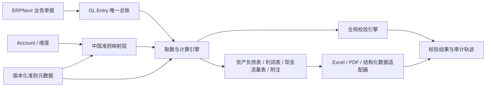

# 中国小企业会计准则 App 设计

状态：阶段 B 的 66 个一级科目建账基线已实现；映射、报表和校验引擎尚未实现
建议 App 名称：`china_sme_accounting`  
目标平台：Frappe V16 / ERPNext V16  
范围：会计准则适配、映射、报表、校验、导出和审计能力  
不包含：任何企业业务数据、自动判定准则适用资格、税务申报或电子发票平台直连

## 1. 法规与标准基线

本设计以财政部发布的下列文件为基线：

1. [《小企业会计准则》](https://kjs.mof.gov.cn/zhengcefabu/201111/P020111118325852319878.pdf)，包括会计确认、计量、报告要求和衔接原则。
2. [《小企业会计准则——会计科目、主要账务处理和财务报表》](https://kjs.mof.gov.cn/zhengcefabu/201111/P020111118325852734144.pdf)，规定标准科目和资产负债表、利润表、现金流量表、附注等输出结构。
3. [《会计软件基本功能和服务规范》财会〔2024〕12号](https://www.mof.gov.cn/jrttts/202408/t20240809_3941453.htm)，要求软件具备会计资料输出、归档、标准数据接口、操作日志、安全和可追溯能力。
4. [电子凭证会计数据标准应用要求](https://kjs.mof.gov.cn/zt/kuaijixinxihuajianshe/dzpzkjsjbzshsd/gjb/202602/t20260204_3983327.htm)，作为电子凭证结构化数据接入与输出的后续兼容目标。

法规内容必须由具备资质的会计专业人员确认。本 App 提供软件控制和报表工具，不替代企业对准则适用性、会计政策或具体交易处理的专业判断。

## 2. 核心设计原则

### 2.1 不复制总账

ERPNext 的 `GL Entry`、`Account`、`Fiscal Year`、`Cost Center`、`Accounting Dimension` 和原始业务单据继续作为唯一记账事实源。本 App 不建立第二套分录表、不直接改写已提交总账，也不绕过 ERPNext 的提交、取消和冲销机制。

### 2.2 映射而非侵入修改

标准科目、报表项目和企业实际科目之间通过独立映射 DocType 关联。不在 ERPNext `Account` 中硬编码中国准则逻辑，避免上游升级、一个站点多公司或未来切换准则时产生冲突。

### 2.3 标准版本不可变

发布过的准则包、标准科目和报表公式只读且带版本号。法规变化通过新增标准版本处理，不覆盖历史版本。每份报表都记录使用的准则版本、映射版本和生成时间，以便重现。

### 2.4 企业配置与公共元数据分离

- 公共元数据：准则代码、标准科目定义、报表行次、公式结构、校验规则模板。
- 企业运行数据：公司选择、实际科目映射、会计政策、报表结果、检查结果和导出记录。

公共仓库只能包含经过来源审查的公共元数据及完全虚构的测试数据；企业运行数据只存在于站点数据库和私有附件中。

## 3. 功能边界

### 3.1 MVP 范围

- 为 ERPNext 公司启用指定版本的小企业会计准则配置。
- 维护企业实际科目到标准科目及报表项目的有效期映射。
- 提供映射覆盖率、余额方向、借贷平衡和结账前完整性检查。
- 从 ERPNext 总账生成资产负债表、利润表和现金流量表。
- 提供财务报表附注的结构化字段框架，但不自动编造披露内容。
- 输出可审计的 Excel/PDF/结构化数据包及校验清单。
- 记录配置、映射、规则、生成和导出操作的审计信息。

### 3.2 后续范围

- 电子凭证结构化数据的接收、验签、入账关联和归档。
- 国家统一会计数据接口、XBRL 或监管要求格式的适配器。
- 从其他会计制度迁入小企业会计准则的受控转换工作台。
- 多期间比较、合并展示和更细的附注自动取数。

### 3.3 明确不做

- 自动判断企业是否符合小企业会计准则适用条件。
- 替代会计人员决定收入确认、资产计量、减值或税会差异处理。
- 税务申报、发票开具、税控设备或地方电子税务局直连。
- 在安装时创建公司、真实科目、期初余额、客户、供应商或凭证。
- 修改 Frappe、ERPNext 或 CRM 官方源码。

## 4. 组件架构



建议 App 内部分层：

```text
china_sme_accounting/
├── standard/       # 版本化公共准则元数据及加载服务
├── mapping/        # 企业科目、报表行和现金流映射
├── engine/         # 按期间、公司和维度读取 GL 并计算
├── validation/     # 覆盖率、平衡、方向、期间和配置校验
├── reports/        # Frappe Query/Script Report 与打印格式
├── export/         # Excel、PDF、结构化数据和哈希清单
├── audit/          # 生成记录、操作日志和可追溯信息
├── api/v1/         # 稳定、版本化的服务接口
└── patches/        # 幂等迁移，不包含企业数据
```

## 5. 数据模型

### 5.1 `China Accounting Standard Profile`

每个公司在一个有效期间只能有一个启用配置。

| 字段 | 类型 | 说明 |
| --- | --- | --- |
| `company` | Link/Company | ERPNext 公司 |
| `standard_code` | Data | 例如准则包稳定标识，不使用可变名称作主键 |
| `standard_version` | Link | 指向不可变准则版本 |
| `effective_from` | Date | 生效日期 |
| `effective_to` | Date | 可空；不得与同公司配置重叠 |
| `base_currency` | Link/Currency | 必须与公司账簿配置校验 |
| `mapping_version` | Int | 映射发布序号 |
| `status` | Select | Draft / Active / Retired |
| `policy_notes` | Small Text | 仅由企业自行维护的会计政策说明 |

启用前必须完成适用资格人工确认、映射覆盖检查和期初衔接确认。系统只记录确认，不替代判断。

### 5.2 `China Accounting Standard Version`

公共、只读的版本头，记录法规依据、发布日期、适用日期、内容哈希和 App 版本。已用于正式报表的版本禁止原地修改。

### 5.3 `China Standard Account`

版本化标准科目定义：标准版本、科目代码、名称、类别、余额方向、父科目、允许明细、报表默认归属。数据来自官方附录，进入仓库前必须保留来源、核对记录和许可证/引用说明。

### 5.4 `China SME Account Mapping`

| 字段 | 说明 |
| --- | --- |
| `profile` | 所属公司准则配置 |
| `erpnext_account` | 企业实际 ERPNext 科目 |
| `standard_account` | 标准科目 |
| `balance_sheet_line` | 资产负债表行次，可按规则派生 |
| `income_statement_line` | 利润表行次，可按规则派生 |
| `cash_flow_rule` | 现金流分类规则引用 |
| `effective_from/to` | 映射有效期间 |
| `mapping_status` | Draft / Reviewed / Active / Retired |
| `reviewed_by/at` | 复核责任与时间 |

同一实际科目在同一期间只能存在一条有效主映射。映射变更不得改变已冻结期间的历史报表重现结果。

### 5.5 `China Report Definition` 与 `China Report Line`

公共、版本化的报表结构。报表行定义行次、层级、数据类型、余额方向、显示规则、公式和舍入规则。公式只能引用稳定行代码，不在文档或客户端脚本中拼接 SQL。

### 5.6 `China Cash Flow Mapping Rule`

现金流量分类规则按优先级匹配账户、对方账户、凭证类型和业务方向。规则必须给出可解释的命中原因；未命中或多重命中进入待处理清单，不能静默归类。

### 5.7 `China Compliance Check Run` 与 `Result`

保存检查时点、公司、期间、准则/映射版本、规则版本、摘要和明细。结果等级为 `Error`、`Warning`、`Info`；只有明确配置的 Error 可以阻止报表定稿，不能阻止 ERPNext 正常记账而造成业务停摆。

### 5.8 `China Statement Run`

记录报表生成参数、输入总账截止时间、准则版本、映射版本、计算哈希、生成者和输出附件。草稿可重算；定稿后不可覆盖，只能生成新修订版。

### 5.9 `China Accounting Export Job`

记录导出格式版本、范围、生成状态、文件哈希、签名状态、下载者和保留期限。导出文件进入站点 private files，不进入 public files。

## 6. 与 ERPNext 的集成

### 6.1 读取对象

- `Company`、`Fiscal Year`、`Accounting Period`
- `Account`、`GL Entry`
- `Cost Center` 和启用的 `Accounting Dimension`
- `Journal Entry`、`Payment Entry` 及产生总账的源单据，仅用于追溯
- `Currency Exchange`，用于核对而非重建 ERPNext 汇兑逻辑

### 6.2 写入边界

App 只写自己的配置、映射、校验、报表运行和导出记录。MVP 不写 `GL Entry`，不自动提交或取消任何 ERPNext 业务单据。

### 6.3 Hooks

- `after_install`：安装角色、DocType、Workspace 和公共准则包；不创建公司或企业科目。
- `before_uninstall`：若存在启用配置或已定稿报表则阻止卸载，并给出归档提示。
- `doc_events`：监听 `Account` 的重命名、禁用和合并，只标记映射待复核。
- `scheduler_events`：可选执行映射完整性检查；默认不自动生成正式报表。
- `permission_query_conditions`：按公司权限过滤配置、检查、报表和导出记录。

禁止通过 hook 改写 ERPNext 核心分录计算结果。

## 7. 报表计算

### 7.1 共同处理链

```text
公司与期间校验
-> 锁定准则版本和映射版本
-> 查询已提交 GL Entry
-> 按实际科目及有效日期解析映射
-> 按报表行聚合
-> 应用方向、重分类、公式和舍入
-> 执行平衡及勾稽检查
-> 生成草稿或不可变定稿
```

所有金额使用 ERPNext/数据库 Decimal，不使用二进制浮点数。展示舍入与内部计算精度分离，差额必须进入明确的舍入检查，不能隐藏。

### 7.2 资产负债表

- 支持期末余额与年初余额。
- 校验资产合计等于负债和所有者权益合计。
- 负余额重分类由版本化规则完成，并保留来源科目明细。

### 7.3 利润表

- 支持本月金额与本年累计金额。
- 与损益类科目、结转分录和本年利润进行勾稽检查。
- 不自动推测企业特定收入确认政策。

### 7.4 现金流量表

- 基于现金及现金等价物账户、对方分录和规则分类。
- 未分类项必须可下钻至原始凭证，并由有权限人员确认规则。
- 现金净增加额应与资产负债表相关项目执行勾稽校验。

### 7.5 附注

附注由“自动取数字段 + 人工披露字段 + 来源引用”组成。系统不得使用生成式内容自动填充未经会计人员确认的事实或政策判断。

## 8. 校验规则

MVP 至少提供：

1. 启用公司的所有叶子科目映射覆盖率。
2. 同期间重复或重叠映射。
3. 标准科目与实际科目类别、余额方向冲突。
4. 借方合计与贷方合计平衡。
5. 资产负债表恒等式。
6. 利润表累计额与损益结转的勾稽关系。
7. 现金流量表现金净增加额勾稽。
8. 已冻结期间之后出现回溯分录或映射变化。
9. 禁用、合并或删除科目仍被有效映射引用。
10. 报表与导出所用标准版本、映射版本和内容哈希完整。

规则结果必须可解释、可下钻、可复核，不能只返回“合规/不合规”布尔值。

## 9. API 设计

稳定接口使用版本命名空间：

```text
china_sme_accounting.api.v1.get_profile
china_sme_accounting.api.v1.get_mapping_coverage
china_sme_accounting.api.v1.run_compliance_check
china_sme_accounting.api.v1.generate_statement
china_sme_accounting.api.v1.get_statement_status
china_sme_accounting.api.v1.create_export
```

要求：

- 所有写操作使用 Frappe 权限检查、CSRF/令牌认证和幂等键。
- 长耗时检查、报表及导出进入后台队列，返回 Job ID。
- API 返回准则版本、映射版本和计算哈希。
- 不允许调用方提交任意 SQL、Python 表达式或未登记的报表公式。
- 大文件通过受权限保护的 private file 下载，不直接返回数据库路径。

## 10. 权限与审计

建议角色：

| 角色 | 权限 |
| --- | --- |
| `China Accounting Manager` | 创建配置、发布映射、定稿报表 |
| `China Accountant` | 编辑草稿映射、运行检查和草稿报表 |
| `China Accounting Reviewer` | 复核映射、查看审计轨迹、批准定稿 |
| `China Accounting Exporter` | 生成和下载已授权导出包 |
| `China Accounting Auditor` | 只读访问定稿、来源和哈希信息 |

关键 DocType 启用 `track_changes`。发布映射、定稿报表和生成监管导出应要求复核权限，并记录操作者、时间、输入版本、结果哈希和来源范围。避免在普通日志中输出凭证摘要、附件内容或个人信息。

## 11. 公共准则包

建议目录：

```text
china_sme_accounting/standards/cn_sme_2011_v1/
├── manifest.json          # 标准标识、来源、哈希和生效日期
├── accounts.json          # 标准科目公共元数据
├── statements.json        # 报表行次和公式
├── validation_rules.json  # 通用校验规则
└── README.md              # 人工核对记录和来源说明
```

准则包发布后不可修改；修正错误也要增加补丁版本并提供迁移说明。企业实际映射不能放入该目录或 Frappe fixtures。

## 12. 安装与迁移

1. `bench --site <site> install-app china_sme_accounting` 只安装元数据和公共准则包。
2. 管理员在站点内选择公司并创建草稿 Profile。
3. 会计人员导入或手工建立科目映射。
4. 完成衔接、期初余额、覆盖率和勾稽检查后人工启用。
5. App 升级通过幂等 patch 添加新结构或新准则版本；不得自动改变已启用企业的准则或映射。

从其他会计制度切换属于受控迁移项目，必须独立备份、清查资产负债、建立转换映射、录入调整并由企业确认，不由普通 App 升级自动完成。

## 13. 测试策略

### 13.1 测试数据

只使用代码生成的虚构公司、科目和凭证。测试名称、税号、银行账号、人员和附件不得来自真实企业。

### 13.2 自动化测试

- 单元测试：公式、方向、有效期、重分类、舍入和现金流规则。
- 属性测试：任意平衡分录聚合后仍满足借贷平衡和报表恒等式。
- 集成测试：ERPNext 单据提交、取消、冲销后报表结果正确。
- 权限测试：跨公司隔离、导出下载、定稿和复核权限。
- 迁移测试：旧 App 版本升级、准则包并存、历史报表可重现。
- 性能测试：百万级 GL Entry 下按公司、期间和维度生成报表。
- 安全测试：公式注入、SQL 注入、越权下载、恶意附件和日志泄露。
- 恢复测试：数据库与 sites 同点恢复后哈希和报表可重现。

### 13.3 专业验收

由会计专业人员使用财政部标准表样建立独立期望结果，对标准科目、主要账务处理、报表行次、公式、附注和衔接规则逐项签字确认。软件测试通过不等于会计专业验收通过。

## 14. 版本和升级策略

- App 使用独立语义版本，不与 ERPNext 补丁号绑定。
- 每个 App 版本声明兼容的 Frappe/ERPNext V16 范围和准则包版本。
- ERPNext V16 升级前运行兼容性 CI：安装、迁移、权限、报表和性能冒烟测试。
- 禁止修改 ERPNext 核心源码以解决兼容问题；使用 hooks、override 白名单接口或向上游提交修复。
- V17 支持建立独立分支和迁移计划，不在 V16 补丁中隐式引入。

## 15. 分阶段实施

### 阶段 A：App 空骨架（已完成）

创建 Frappe App、模块、角色、Workspace、CI 和空站点安装测试，不加入准则数据。

### 阶段 B：标准元数据与映射（部分完成）

已加入经财政部来源核对的版本化 66 个一级科目，并提供新建公司时的模板选择。报表结构、Profile 和 Account Mapping 尚未实现。候选网络文件中的企业自定义明细和历史税费明细未导入；核对记录位于 App 准则包目录。

### 阶段 C：报表与校验

实现资产负债表、利润表、现金流量表、附注框架和可解释校验。

### 阶段 D：导出与审计

实现 Excel/PDF、结构化数据、哈希清单、审计工作台和恢复验证。

### 阶段 E：电子凭证与监管适配

根据财政部正式标准和验证工具增加独立适配器，不污染核心映射和报表引擎。

## 16. 验收标准

设计进入实现前必须确认：

- App 名称、许可证、维护组织和公开/私有边界。
- 准则适用资格由谁确认，软件只记录何种证据。
- 标准科目和报表模板的专业审核责任人。
- 现金流量表生成方法和人工复核流程。
- 报表定稿、修订、冻结和导出审批职责。
- 公共准则包的来源、版本、哈希和更新流程。
- 与 ERPNext V16 各升级版本的兼容测试矩阵。
- 电子凭证、XBRL、税务和档案接口哪些进入后续版本。
