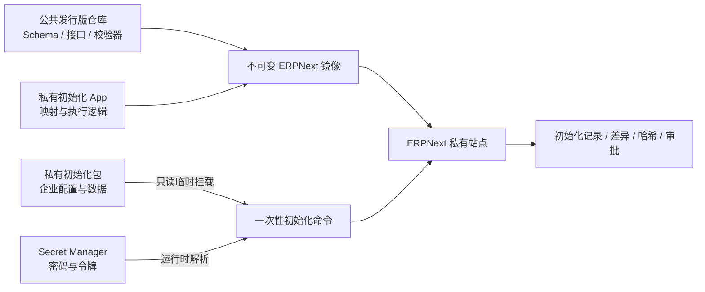
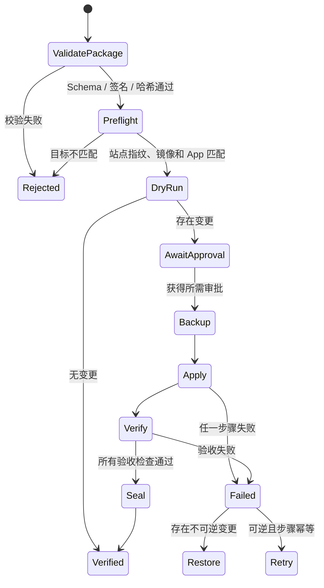

# 私有企业初始化方案

状态：设计已采纳，尚未实现执行器  
适用范围：ERPNext V16 中文单容器发行版  
核心约束：公共仓库、公共镜像和公共 CI 不接触任何企业私有数据

## 1. 目标

企业初始化需要解决两个相互冲突的目标：一方面要让公司、会计、组织、权限和基础资料能够重复部署；另一方面不能把企业数据、密码或集成凭据写进公共发行版。

本方案采用“公共契约、私有代码、私有数据、受控执行”模型：



公共发行版只定义初始化清单 Schema 和扩展契约。企业专属转换逻辑放入私有 Frappe App；企业数据放入独立私有初始化包；敏感凭据由 Secret Manager 在运行时提供。

## 2. 四层边界

### 2.1 公共发行版仓库

允许包含：

- 初始化清单 JSON Schema。
- 初始化 CLI/API 契约、状态机和错误码文档。
- 不含企业信息的校验器和完全虚构的自动化测试。
- 对私有 App 的 BuildKit secret/SSH 接入接口。

禁止包含：

- 公司名称、税号、统一社会信用代码、地址、银行账号或联系人。
- 企业科目映射、成本中心、部门、员工、用户、客户、供应商或物料。
- 期初余额、凭证、附件、历史交易、真实域名和集成端点。
- 密码、API token、证书、私有仓库 URL 或解密密钥。

### 2.2 私有初始化 App

建议 App 名称：`enterprise_bootstrap`。它负责：

- 注册 `bench --site <site> enterprise-init` 命令。
- 读取和校验初始化清单及 payload。
- 把外部稳定标识映射为 ERPNext DocType 和字段。
- 执行 dry-run、apply、verify、seal。
- 保存步骤状态、内容哈希、差异和审计摘要。
- 实现企业特有的字段转换，但不在代码中硬编码密码或企业数据。

该 App 通过 `docker/apps.private.json` 对应的 BuildKit secret 接入镜像。代码可以与数据使用不同访问权限和不同维护周期。

### 2.3 私有初始化包

初始化包是版本化、签名或加密的部署制品，不进入公共 Git。建议结构：

```text
enterprise-init-<version>/
├── manifest.yaml             # 目标指纹、镜像 digest、步骤和文件哈希
├── payloads/                 # 企业私有配置或数据
│   ├── site-settings.yaml
│   ├── company.yaml
│   ├── accounting.yaml
│   ├── dimensions.yaml
│   ├── organization.yaml
│   └── users.yaml
├── approvals/                # 审批引用，不放手写密码
├── checksums.sha256
└── signature                 # 可选签名
```

目录仅为结构约定，本公共仓库不提供企业样例包。清单必须符合 [私有企业初始化清单 Schema](../schemas/private-enterprise-init-manifest.schema.json)。

### 2.4 Secret Manager

初始化包只能保存秘密引用，例如 `secret://erp/prod/bank-api`，不得保存实际值。执行器在运行时从 Docker secret、Vault、云秘密管理服务或受控文件描述符读取，并确保：

- 秘密不出现在命令参数、进程列表、差异报告和日志中。
- 解密密钥与加密包分离管理。
- 初始化用临时凭据具有最小权限和到期时间。
- 创建用户时使用邀请或重置流程，不分发固定默认密码。

## 3. 初始化不等于数据迁移

流程必须拆成三个独立包和审批门：

| 模式 | 内容 | 默认策略 | 风险等级 |
| --- | --- | --- | --- |
| `bootstrap` | 站点设置、公司框架、会计期间、维度、角色和权限框架 | 可幂等重跑 | 中 |
| `master-data` | 用户、组织、客户、供应商、物料及其他主数据 | 显式差异确认 | 高 |
| `cutover` | 期初余额、未结项目、历史交易和切换控制 | 双人审批、备份后执行 | 极高 |

容器 Entrypoint 只负责创建空站点、安装 App 和运行迁移，禁止自动执行以上任何企业初始化包。

## 4. 清单契约

公共 Schema 位于 `schemas/private-enterprise-init-manifest.schema.json`。清单只保存控制元数据，不直接嵌入企业 payload。

关键字段：

- `packageId`、`version`：初始化包稳定身份和语义版本。
- `environment`：development、test、staging 或 production。
- `siteFingerprint`：目标站点不可逆指纹，防止发往错误站点。
- `imageDigest`：要求的发行版镜像 digest。
- `apps`：要求的 App 及版本。
- `mode`：bootstrap、master-data 或 cutover。
- `steps`：有序步骤、payload 相对路径、SHA-256、策略及审批要求。

清单不得用站点 URL 作为唯一目标标识，因为域名可能变化。站点指纹建议由站点 UUID、部署环境 ID 和受控 salt 计算，执行器只比较哈希。

## 5. 初始化状态机



生产环境禁止跳过 dry-run、目标指纹、备份和 verify。`--force` 不能绕过站点不匹配、哈希失败、镜像不匹配或缺少审批。

## 6. 幂等和差异规则

每条初始化记录必须有企业侧稳定外部 ID，不能依赖 ERPNext 自动名称或显示名称。执行器维护 `Enterprise Init Object Map`，关联：

```text
package_id + step_id + external_id
-> doctype + document_name + input_hash + applied_at
```

支持三种策略：

- `create-only`：已存在即验证；内容不一致时报错，禁止静默覆盖。
- `upsert-explicit`：只更新 payload 明确列出的允许字段，禁止全对象覆盖。
- `verify-only`：不写数据，只验证目标状态。

默认禁止自动删除。停用、合并、取消或删除必须成为独立步骤并经过更高等级审批。已提交单据不得通过 upsert 修改。

每个步骤使用独立事务和初始化锁：

1. 获取站点级 `enterprise-init` 排他锁。
2. 校验依赖步骤、输入哈希和目标前置状态。
3. 在事务中执行一个有限步骤。
4. 保存对象映射和结果摘要。
5. 提交后执行只读验证。

步骤中断时只重试未完成或输入哈希相同的步骤；哈希变化必须创建新包版本并重新 dry-run。

## 7. 建议执行顺序

### 7.1 Bootstrap

1. 站点语言、时区、日期/数字格式等非秘密设置。
2. 公司框架和本位币。
3. 财政年度、会计期间和冻结策略。
4. 科目框架、会计准则 Profile 和科目映射。
5. 成本中心、项目和其他核算维度。
6. 仓库、价格表、税类等配置框架。
7. 角色、权限和审批工作流框架。
8. 初始化完整性校验。

### 7.2 Master Data

1. 组织、部门和岗位。
2. 用户邀请和公司权限。
3. 客户、供应商、联系人和地址。
4. 物料、物料组、计量单位和价格规则。
5. 银行账户、税号等高敏主数据，使用更严格权限和日志脱敏。
6. 数量、唯一性、必填项和引用完整性对账。

### 7.3 Cutover

1. 冻结源系统并取得最终快照。
2. 验证 ERPNext 目标为空或处于批准的切换状态。
3. 导入期初余额、未结应收应付、库存和必要历史对象。
4. 执行总账、客户、供应商、库存和现金银行对账。
5. 由业务负责人和财务负责人双人批准。
6. 密封初始化包版本和报告，撤销临时凭据。

Cutover 不允许与容器首次启动或普通镜像升级自动绑定。

## 8. 执行接口

建议 CLI：

```text
bench --site <site> enterprise-init validate --package /run/erpnext-init
bench --site <site> enterprise-init plan --package /run/erpnext-init --output /run/plan.json
bench --site <site> enterprise-init apply --package /run/erpnext-init --approval-ref <ref>
bench --site <site> enterprise-init verify --run <run-id>
bench --site <site> enterprise-init status --run <run-id>
bench --site <site> enterprise-init seal --run <run-id>
```

生产运行时把私有包只读挂载到 `/run/erpnext-init:ro`。计划和结果写到站点 private files 或外部审计存储，不写回初始化包。

长任务进入 Frappe 队列，但 CLI 必须等待并返回确定的成功/失败退出码。API 如需开放，应只允许触发已上传、已验证、已审批的包，不能接受任意服务器文件路径。

## 9. 审计数据模型

私有 App 建议提供：

### `Enterprise Init Run`

- package ID/version、mode、目标指纹和环境。
- 镜像 digest、App 版本和数据库备份引用。
- 状态、操作者、审批引用、开始/完成时间。
- 包清单哈希、计划哈希、结果哈希。
- 创建、更新、跳过、失败和警告数量。

### `Enterprise Init Step`

- step ID、输入哈希、策略和依赖。
- 执行前后摘要、事务状态和验收结果。
- 不保存秘密、完整 payload 或高敏字段明文。

### `Enterprise Init Object Map`

- 外部 ID 到 ERPNext 文档名的稳定映射。
- 最近应用的包版本和输入哈希。
- 合并、重命名或停用状态。

审计记录不可由普通初始化操作者删除；保留期限由企业合规策略决定。

## 10. 备份与失败恢复

### 可逆配置步骤

在步骤事务未提交前使用数据库回滚。已提交后优先执行显式补偿步骤，不通过隐式“反向 upsert”猜测旧状态。

### 不可逆或跨对象步骤

Master Data 批量变更和 Cutover 以恢复数据库与 `sites` 同一时间点备份作为唯一可靠回滚路径。执行前必须验证备份可读、记录校验和，并在隔离环境完成恢复演练。

失败后禁止继续后续依赖步骤。恢复完成后使用相同包重新 plan，不能直接把失败 Run 改成成功。

## 11. 多环境提升

建议采用不可变包逐级提升：

```text
development -> test -> staging -> production
```

- 同一个包内容哈希在各环境保持不变。
- 环境差异使用 Secret Ref 和目标绑定解决，不复制修改 payload。
- Production 只接受已在 staging 验证的包哈希。
- 企业数据不能从 production 反向复制到公共 CI；必要测试数据使用规则生成的虚构数据。

如果各环境确实需要不同企业数据，应生成不同 package ID/version，并分别审批，不能绕开哈希验证。

## 12. 安全控制

1. 初始化容器会话仅在维护窗口开放，不长期挂载私有包。
2. 执行身份采用最小 Frappe 角色和临时基础设施权限。
3. 包使用 SHA-256 清单；生产建议增加签名验证和允许签名者列表。
4. 日志对税号、银行账号、手机号、邮箱和凭据做字段级脱敏。
5. 差异报告显示字段名和摘要，不默认显示完整敏感值。
6. 私有包、计划和结果均按企业数据分类加密和设置保留期限。
7. CI 只能执行 Schema 和虚构数据测试，不能访问生产 Secret Manager。
8. 初始化完成后移除只读挂载、撤销临时 token 并归档审计结果。

## 13. 与中国会计 App 的关系

`china_sme_accounting` 负责准则 Profile、标准科目、企业实际科目映射、报表和校验；`enterprise_bootstrap` 负责读取私有包和编排初始化步骤。

二者通过公开服务接口协作：

```text
enterprise_bootstrap
-> china_sme_accounting.api.v1.validate_profile_input
-> china_sme_accounting.api.v1.plan_account_mapping
-> china_sme_accounting.api.v1.activate_profile
```

初始化 App 不直接写中国会计 App 的内部表，也不绕过其复核和启用规则。

## 14. 分阶段实施

### 阶段 A：公共契约

- 完成 JSON Schema、状态机、错误码和安全边界。
- 增加公共仓库数据泄露门禁。
- 不实现企业 payload Schema，不添加样例企业。

### 阶段 B：私有 App 空骨架

- 创建 `enterprise_bootstrap`、CLI、Run/Step/Object Map DocType。
- 实现 validate、plan 和 verify-only。
- 使用完全虚构数据进行自动化测试。

### 阶段 C：Bootstrap 执行

- 实现公司、期间、维度、角色和会计 Profile 的幂等初始化。
- 建立审批、锁、审计和备份前置检查。

### 阶段 D：Master Data

- 按 DocType 逐个实现显式字段白名单和对账报告。
- 高敏数据与普通主数据分包授权。

### 阶段 E：Cutover

- 仅在恢复演练、专业验收和双人审批成熟后实现。
- 期初及历史迁移使用独立命令、独立角色和独立维护窗口。

## 15. 验收标准

- 公共 Git 历史和公共镜像不存在企业数据或秘密。
- 初始化包目标错误、签名错误、哈希错误或版本不匹配时强制拒绝。
- 同一包重复执行不会产生重复对象或静默覆盖差异。
- dry-run 能列出预计创建、更新、跳过、冲突和不可逆操作。
- 初始化步骤、对象映射、审批和验证结果完整可审计。
- Master Data 和 Cutover 失败后能够通过已验证备份恢复。
- 初始化完成后企业站点通过公司、权限、会计、主数据和安全检查。
- 任何密码、token、高敏字段都不出现在日志、计划或审计摘要中。

